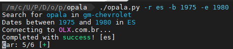
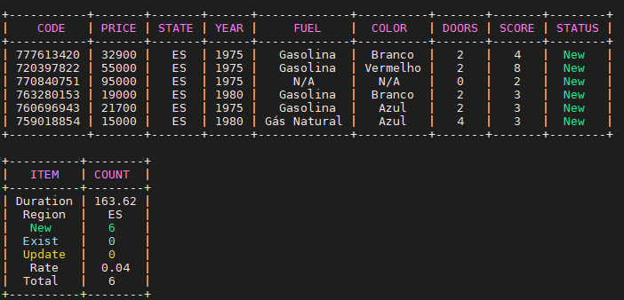
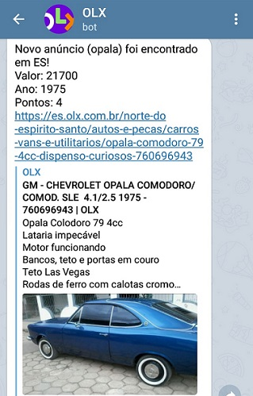
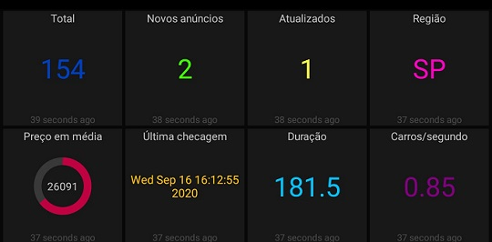

# Opala
Use this project to look for your **Opala**, it helped me a lot!\
It will use [OLX](https://www.olx.com.br) platform according to your parameters.

## Features
- Running on demand or scheduled via CLI
- Also available as Docker container (run [make help](makefile) for more information)
- Define target region (support multiple separated by comma)
- Define car date range (eg: from __1975__ to __1980__)
- Using local database (SQLite) to __save all information__
- Download images into data folder for each offer
- **Score** based on attributes to find good cars
- **Detect** new item and skip if it __already exists__
- Telegram alert - **New** offer
- Telegram alert - **Update** price
- MQTT integration - dashboard with statistics

## Demo
\
\
\

## Configuration
- Starting with **CAR_** is used as **filter**
- Starting with **SCORE_** will give additional **points**

| VARIABLE           | DESCRIPTION            | EXAMPLE       |
| ------------------ |:----------------------:| -------------:|
| APP_IMAGE          | Container image        | opala         |
| APP_VERSION        | Container version      | -             |
| DAEMON_INTERVAL    | Loop interval          | 10            |
| DAEMON_LOG         | Log level              | DEBUG         |
| DATA_MOUNT_ENABLE  | Enable data            | True or False |
| DATA_MOUNT_PATH    | Data path              | /data         |
| CAR_BRAND          | Brand                  | gm-chevrolet  |
| CAR_MODEL          | Model                  | opala         |
| CAR_TITLE          | Offer title            | opala         |
| CAR_DATE_BEGIN     | Year range (begin)     | 1975          |
| CAR_DATE_END       | Year range (end)       | 1980          |
| CAR_KM             | Filter by odometer     | 90000         |
| CAR_REGION         | Target state           | sp,mg,rj      |
| MQTT_ENABLE        | Enable MQTT            | True or False |
| MQTT_HOST          | MQTT host/IP           | localhost     |
| MQTT_PORT          | MQTT port              | 1883          |
| TELEGRAM_ENABLE    | Enable Telegram        | True or False |
| TELEGRAM_BOT_TOKEN | Telegram token         | -             |
| TELEGRAM_CHAT_ID   | Telegram chat          | -             |
| HTTPS_PROXY        | Proxy address:port     | -             |
| HTTP_PROX          | Proxy address:port     | -             |
| NO_PROXY           | Skip proxy             | localhost     |
| SCORE_YEAR         | Preferred              | 1979          |
| SCORE_COLOR        | Preferred color        | Preto         |
| SCORE_DOOR         | Preferred doors        | 2             |
| SCORE_FUEL         | Preferred fuel         | Gasolina      |
| SCORE_TRANSMISSION | Preferred transmission | Manual        |
| SCORE_PRICE        | Maximum price          | 30000         |
| SCORE_KEYWORD      | Words on description   | SS,6cc        |
| SCORE_KM           | Maximum odometer       | 80000         |

## Roadmap
[ ] Support another Database (MySQL)
[ ] Support K8s
[x] Support multiple cars and brands
[ ] Dashboard and Statistics
[x] Configure parameters related to score
[ ] Detect good opportunities
[ ] Duplicated offer
[ ] Alerts based on parameters