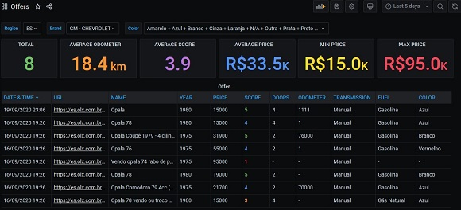
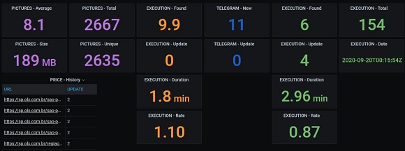

[](https://github.com/uknbr/opala/actions/workflows/build-latest.yml)

# Opala
Use this project to look for your **Opala** or any other **car**.\
It will use [OLX](https://www.olx.com.br) platform according to your parameters.

## Features
- Running on __demand__ or __scheduled__ via CLI
- Also available as __Docker image__ and __Helm Chart__
- Define target region (support multiple separated by comma)
- Define car date range (eg: from __1975__ to __1980__)
- Using local database (SQLite) to __save all information__
- Download images into data folder for each offer
- **Score** based on attributes to find good cars
- **Detect** new item and skip if it __already exists__
- Telegram alert - **New** offer
- Telegram alert - **Update** price
- MQTT integration - dashboard with statistics
- Dashboard with offers, statistics and charts
- Binary for **Windows** platform

## Demo
\


## Usage
- Help

```console
opala:~$ make help
```

- Docker

```console
opala:~$ make build
opala:~$ make start
opala:~$ make status
opala:~$ make log
```

- Helm

```console
opala:~$ cd helm
opala:~$ helm upgrade -i olx-car-opala-es ./olx-car -f config/opala-es.yaml --force --create-namespace --namespace olx
opala:~$ helm upgrade -i olx-car-opala-go ./olx-car -f config/opala-go.yaml --force --create-namespace --namespace olx
```

- Windows
Download the latest [relase ZIP file](https://github.com/uknbr/opala/releases/download/v0.5.5/olx.zip) or build your own binary:

```console
PS C:\ > .\release.bat
```

- Script

```console
opala:~$ make run
opala:~$ make sync
```

## Configuration
- Starting with **CAR_** is used as **filter**
- Starting with **SCORE_** will give additional **points**

| VARIABLE           | DESCRIPTION            | EXAMPLE       |
| ------------------ |:----------------------:| -------------:|
| APP_IMAGE          | Container image        | uknbr/olx_car |
| APP_VERSION        | Container version      | latest        |
| APP_ID             | Container name         | opala         |
| DAEMON_INTERVAL    | Interval in minutes    | 10            |
| DAEMON_LOG         | Log level              | DEBUG         |
| DAEMON_MODE        | Enable loop            | True or False |
| DATA_MOUNT_ENABLE  | Enable data            | True or False |
| DATA_MOUNT_PATH    | Data path              | /data         |
| CAR_BRAND          | Brand                  | gm-chevrolet  |
| CAR_MODEL          | Model                  | opala         |
| CAR_TITLE          | Offer title            | opala         |
| CAR_DATE_BEGIN     | Year range (begin)     | 1975          |
| CAR_DATE_END       | Year range (end)       | 1980          |
| CAR_KM             | Filter by odometer     | 90000         |
| CAR_REGION         | Target state           | sp,mg,rj      |
| MQTT_ENABLE        | Enable MQTT            | True or False |
| MQTT_HOST          | MQTT host/IP           | localhost     |
| MQTT_PORT          | MQTT port              | 1883          |
| TELEGRAM_ENABLE    | Enable Telegram        | True or False |
| TELEGRAM_BOT_TOKEN | Telegram token         | -             |
| TELEGRAM_CHAT_ID   | Telegram chat          | -             |
| HTTPS_PROXY        | Proxy address:port     | -             |
| HTTP_PROX          | Proxy address:port     | -             |
| NO_PROXY           | Skip proxy             | localhost     |
| SCORE_YEAR         | Preferred              | 1979          |
| SCORE_COLOR        | Preferred color        | Preto         |
| SCORE_DOOR         | Preferred doors        | 2             |
| SCORE_FUEL         | Preferred fuel         | Gasolina      |
| SCORE_TRANSMISSION | Preferred transmission | Manual        |
| SCORE_PRICE        | Maximum price          | 30000         |
| SCORE_KEYWORD      | Words on description   | SS,6cc        |
| SCORE_KM           | Maximum odometer       | 80000         |
| MYSQL_SYNC         | Enable MySQL sync      | True or False |
| MYSQL_DATABASE     | DB name                | olx           |
| MYSQL_HOST         | DB host                | localhost     |
| MYSQL_PORT         | DB port                | 3306          |
| MYSQL_USER         | DB user                | -             |
| MYSQL_PASS         | DB password            | -             |

### MQTT

- Make sure you have MQTT server running
- Adjust variables based on [Configuration](#Configuration)
- Install/Configure MQTT client in our Smartphone

### Telegram

- Make sure you have your bot created using [@BotFather](https://telegram.me/BotFather)

```bash
curl -s https://api.telegram.org/bot${TELEGRAM_BOT_TOKEN}/getUpdates | jq .result[].message.chat.id
```

- Adjust variables based on [Configuration](#Configuration)

### MySQL
- Make sure you have MySQL server [running](#Dashboard)
- Adjust variables based on [Configuration](#Configuration)

## Dashboard

Data Visualization using tools:
- [MySQL](#MySQL)
- Adminer
- Grafana

```bash
cd dashboard
docker-compose -f olx.yml up -d
```

\


## Roadmap
- [x] Support another Database (MySQL)
- [x] Support K8s using helm
- [x] Support multiple cars and brands
- [x] Dashboard and Statistics
- [x] Configure parameters related to score
- [x] Detect good opportunities by score
- [ ] Alerts based on parameters
- [x] Support Windows platform
- [ ] Weekly reports
- [ ] Prepare your VM with Ansible